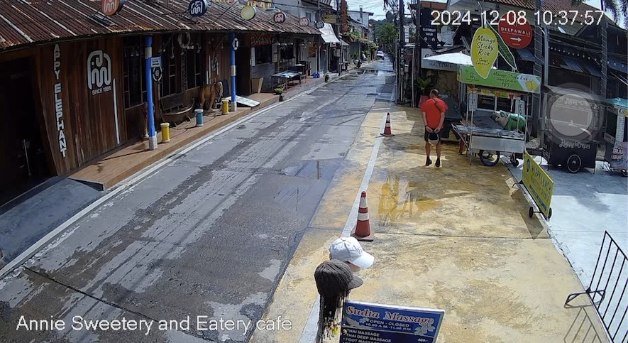

<!--
 * @Description: 
 * @Author: byh呀呀呀
 * @version: 
 * @Date: 2025-01-03 20:26:48
 * @LastEditors: byh呀呀呀
 * @LastEditTime: 2025-01-07 23:28:58
-->
# Tears-illusion-
> Fixed camera under video background modeling, foreground removal

---
## 🔧 Dependencies and Installation


```bash
# 1. Clone repo

git clone https://github.com/gityihang/Tears-illusion-.git
cd Tears-illusion-
```


```bash
# 2. Install dependent packages

conda create -n tears python=3.9 
conda activate tears
pip install --upgrade pip
pip install -r requirements.txt
```
 
## ⚡ Quick Inference

### Usage of REMOVE
```Shell
# 下面展示使用参数说明

Usage: 
-- python function.py [options] 

--video_path              Input folder.
--save_path               Output folder.
--duration_sec            Duration in seconds (default: 30)
--fps_override            FPS Override (default: None)
--save_frames             Save frames (default: False)
```

### Text
You can use the code to test through the following instructions
```Shell
# 你可以使用这个指令，运行固定摄像头下的，前景移除

python function.py  --video_path './data/example/example1.mp4' --save_path './data/output' --duration_sec 30 --save_frames False
```
Your output will be saved in folder <a href="./data/output" style="color: gold;">'./data/output'</a>

## 📰 Other

<a href="./utils/statistic.py" style="color: gold;">'./utils'</a> ： 文件夹下保存统计学指标  
<a href="./test/test.ipynb" style="color: gold;">'./test/test.ipynb'</a> ： 保存一些实验过程数据（之后补充完整） 

## 📧 Result
原始图片


使用前景消除的结果


